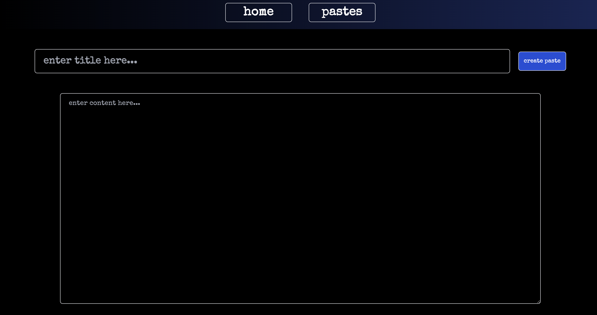
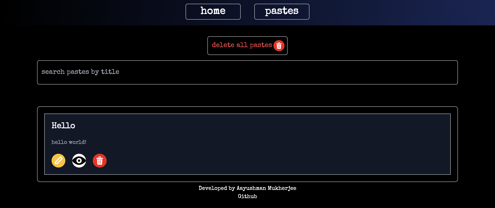
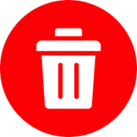

# **Paste - A Note Taking App**
A frontend web app for note taking and note management using `Reactjs`, `TailwindCSS`

# **Preview**
## Home Page

Use this page to create a note by adding a title and filling in the content, then click on `create paste` button to create a note. To view saved notes navigate to `pastes` button besides `home` button

## Pastes Page

Use this page to - 
- View existing notes using  button.
- Update existing notes using  button.
- Delete existing notes using  button.
- All the notes can be deleted at once using `delete all pastes` button.
- Search notes using the title of the note.
# **Website link**
[Try Paste](https://paste-henna.vercel.app/)
